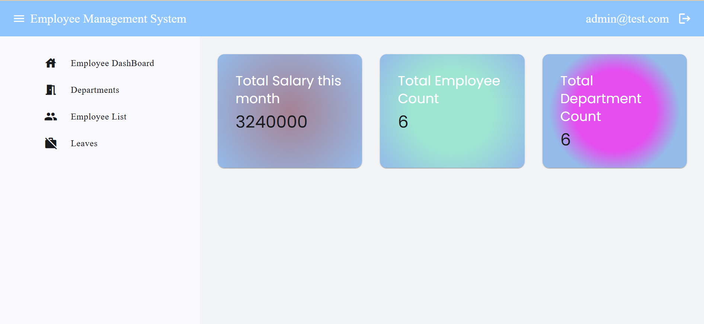
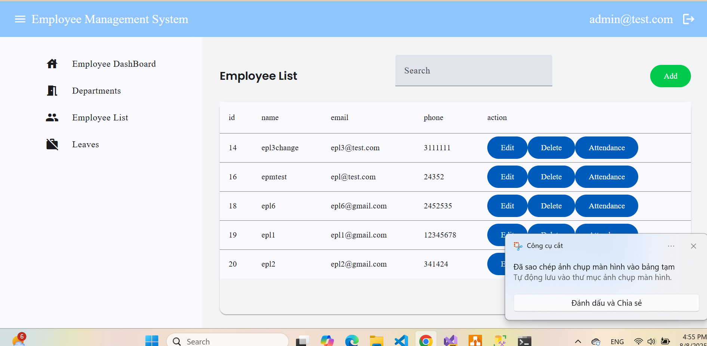
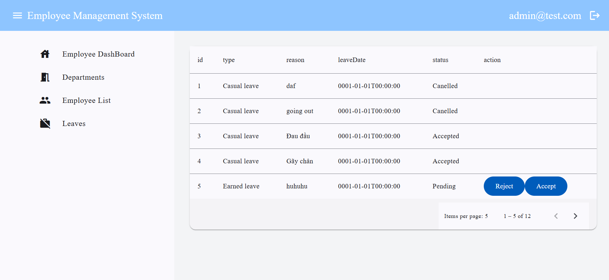
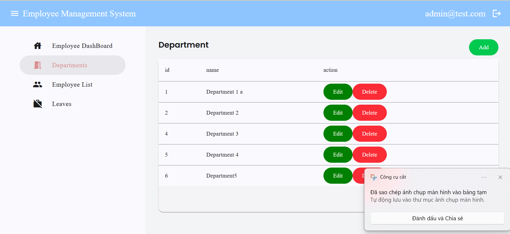
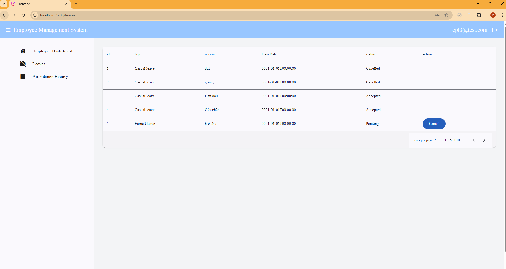
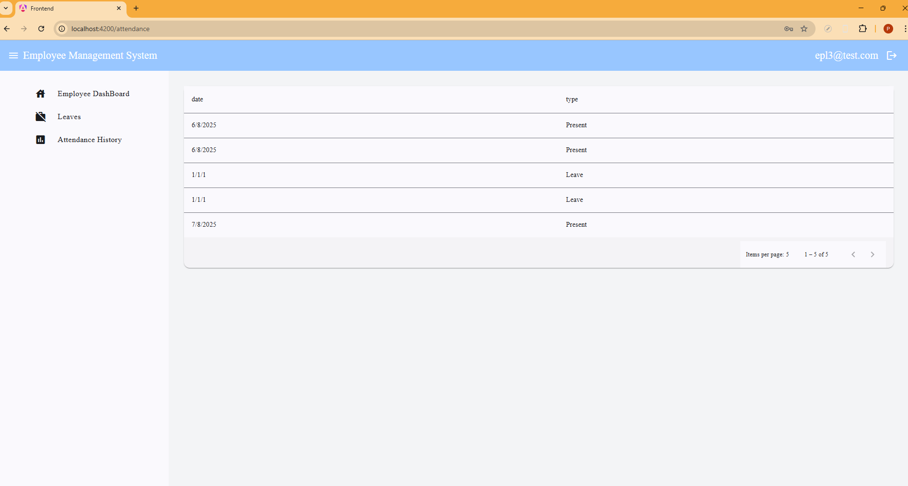

# Employee Management System

## 📋 Giới thiệu
Hệ thống **Quản lý Nhân viên** giúp doanh nghiệp dễ dàng quản lý thông tin nhân sự, phân quyền người dùng, chấm công, quản lý nghỉ phép và tính toán lương.  
Ứng dụng được xây dựng theo mô hình **Client-Server** với **ASP.NET Core Web API** (Backend) và **Angular** (Frontend).

---

## ✨ Tính năng chính
### 🛡 Dành cho Quản lý (Admin)
- **Thống kê tổng quan**:
  - Tổng số nhân viên.
  - Tổng số phòng ban (Department).
  - Tổng lương tháng phải trả cho tất cả nhân viên.
  
- **Quản lý nhân viên**:
  - Thêm, sửa, xóa, tìm kiếm, phân trang.
  - Xem danh sách nhân viên theo phòng ban.
  
- **Quản lý nghỉ phép**:
  - Xem danh sách yêu cầu nghỉ của nhân viên.
  - Đồng ý hoặc từ chối yêu cầu nghỉ.
  
- **Quản lý phòng ban**:
  - Thêm, sửa, xóa, tìm kiếm, phân trang.
  - Xem danh sách  phòng ban.
  

---

### 👩‍💼 Dành cho Nhân viên (Employee)
- **Xem thông tin cá nhân & lương**.
- **Đăng ký nghỉ phép**:
  - Gửi yêu cầu nghỉ kèm lý do.
  - Xem trạng thái yêu cầu (đang chờ, được duyệt, bị từ chối).
    

- **Chấm công hàng ngày**:
  - Check-in / Check-out.
  - Xem lịch sử chấm công cá nhân.
    

---

## 🛠️ Công nghệ sử dụng
### Backend
- **ASP.NET Core Web API**
- **Entity Framework Core** (Code-First)
- **SQL Server**
- **JWT Authentication**
- **Repository Pattern**

### Frontend
- **Angular 17+**
- **Angular Material**
- **RxJS & HttpClient**
- **TypeScript**

---

